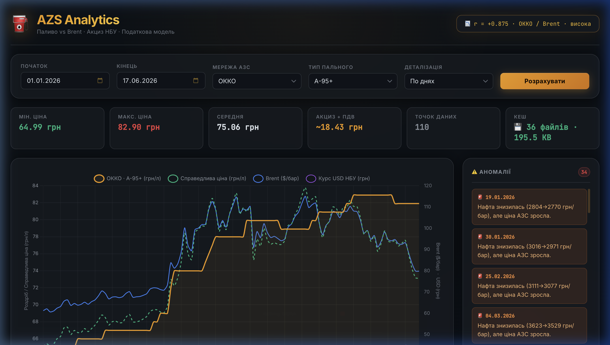

# ⛽ AZS Analytics

> Аналітичний дашборд: ціни на паливо АЗС vs нафта Brent з розрахунком акцизного податку та подвійним курсом НБУ




---

## 🚀 Локальний запуск

```bash
# 1. Клонуємо репозиторій
git clone https://github.com/flesh91/ukraine-azs-fuel-analytics.git
cd ukraine-azs-fuel-analytics

# 2. Встановлюємо залежності
npm install

# 3. Копіюємо конфіг і за потреби редагуємо
cp .env.example .env   # або просто перевіряємо .env

# 4. Запуск
npm run dev    # розробка — auto-reload через nodemon
npm start      # production-режим без nodemon
```

Відкрийте **http://localhost:3000**

---

## 🖥 Розгортання на сервері

### Варіант 1 — PM2 (рекомендовано)

[PM2](https://pm2.keymetrics.io/) — менеджер процесів для Node.js. Перезапускає додаток після збоїв і при перезавантаженні сервера.

```bash
# Встановлюємо PM2 глобально
npm install -g pm2

# Запускаємо додаток
pm2 start server/server.js --name azs-analytics

# Автозапуск після перезавантаження ОС
pm2 startup        # виконати команду, яку виведе ця команда
pm2 save

# Корисні команди
pm2 status         # стан процесів
pm2 logs azs-analytics   # логи в реальному часі
pm2 restart azs-analytics
pm2 stop azs-analytics
```

---

### Варіант 2 — systemd (Linux)

Якщо PM2 не встановлений, можна зареєструвати службу напряму.

**Створіть файл `/etc/systemd/system/azs-analytics.service`:**

```ini
[Unit]
Description=AZS Analytics Node.js App
After=network.target

[Service]
Type=simple
User=www-data
WorkingDirectory=/var/www/azs-analitycs
ExecStart=/usr/bin/node server/server.js
Restart=on-failure
RestartSec=5
StandardOutput=syslog
StandardError=syslog
SyslogIdentifier=azs-analytics
Environment=PORT=3000
Environment=NODE_ENV=production

[Install]
WantedBy=multi-user.target
```

```bash
systemctl daemon-reload
systemctl enable azs-analytics
systemctl start azs-analytics
systemctl status azs-analytics
```

---

### Варіант 3 — Nginx як reverse proxy

Якщо Node.js запущений на порту 3000, а Nginx обробляє зовнішній трафік (80/443):

```nginx
server {
    listen 80;
    server_name your-domain.com;

    # Перенаправлення на HTTPS (якщо є SSL)
    # return 301 https://$host$request_uri;

    location / {
        proxy_pass         http://127.0.0.1:3000;
        proxy_http_version 1.1;
        proxy_set_header   Host              $host;
        proxy_set_header   X-Real-IP         $remote_addr;
        proxy_set_header   X-Forwarded-For   $proxy_add_x_forwarded_for;
        proxy_set_header   X-Forwarded-Proto $scheme;
        proxy_read_timeout 60s;   # важливо: перший запит може займати ~10 сек
    }

    # Кешування статики на рівні Nginx
    location ~* \.(css|js|ico|png|woff2)$ {
        proxy_pass http://127.0.0.1:3000;
        expires 7d;
        add_header Cache-Control "public, immutable";
    }
}
```

```bash
nginx -t          # перевірка конфігу
systemctl reload nginx
```

---

### Варіант 4 — Docker

```dockerfile
# Dockerfile
FROM node:20-alpine
WORKDIR /app
COPY package*.json ./
RUN npm ci --omit=dev
COPY . .
RUN mkdir -p data
EXPOSE 3000
CMD ["node", "server/server.js"]
```

```bash
# Збираємо образ
docker build -t azs-analytics .

# Запускаємо з монтуванням data/ назовні (щоб кеш зберігався між перезапусками)
docker run -d \
  --name azs-analytics \
  -p 3000:3000 \
  -v $(pwd)/data:/app/data \
  --restart unless-stopped \
  azs-analytics
```

---

### Змінні середовища для production

Файл `.env` або системні змінні:

```env
PORT=3000                  # порт сервера
CACHE_TTL_SECONDS=3600     # TTL in-memory кешу (сек); поточний місяць завжди свіжий
```

> **Важливо:** директорія `data/` зберігає JSON-кеш минулих місяців.
> При першому запуску вона порожня — всі дані завантажуються з інтернету (~5–10 сек на місяць).
> При наступних запитах відповідь приходить з диска за ~15–50 мс.

## 📁 Структура проекту

```
azs-analitycs/
├── server/
│   ├── server.js                  # Точка входу HTTP сервера
│   ├── app.js                     # Express app factory
│   ├── config/
│   │   └── index.js               # Конфігурація з .env
│   ├── routes/
│   │   └── api.js                 # GET /api/analytics, /api/cache-info
│   ├── controllers/
│   │   └── analyticsController.js # Валідація параметрів, делегування
│   ├── services/
│   │   ├── analyticsService.js    # 🧮 Чиста бізнес-логіка (акциз, регресія, кореляція)
│   │   └── dataService.js         # Оркестрація fetch → кеш → мерж
│   ├── repositories/
│   │   ├── fuelRepository.js      # Парсинг цін на паливо з minfin.com.ua
│   │   ├── oilRepository.js       # Парсинг цін на нафту Brent з minfin.com.ua
│   │   ├── nbuRepository.js       # Курси USD/EUR з bank.gov.ua API
│   │   └── cacheRepository.js     # 💾 Персистентний JSON-кеш (./data/)
│   ├── middleware/
│   │   └── errorHandler.js        # Глобальний обробник помилок Express
│   └── utils/
│       └── dateUtils.js           # parseMinfinDate, getMonthRange, forwardFill
├── client/
│   ├── index.html
│   ├── css/styles.css             # Premium dark-theme UI
│   └── js/
│       ├── api.js                 # fetch → /api/analytics
│       ├── chart.js               # Chart.js менеджер
│       ├── ui.js                  # DOM-маніпуляції
│       └── main.js                # Точка входу фронтенду
├── data/                          # 💾 Локальний JSON-кеш (автогенерується)
│   ├── fuel/<brand>:<fuelType>/   # напр. data/fuel/okko:A-95+/2026-01.json
│   ├── oil/                       # напр. data/oil/2026-01.json
│   └── nbu/<usd|eur>/             # напр. data/nbu/usd/2026-01.json
├── nodemon.json                   # Watch тільки server/ (ігнорує data/)
├── .env                           # PORT, CACHE_TTL_SECONDS
└── package.json
```

---

## 🌐 Джерела даних

### 1. Ціни на паливо — [minfin.com.ua](https://index.minfin.com.ua/ua/markets/fuel/)

**URL:** `https://index.minfin.com.ua/ua/markets/fuel/tm/<brand>/<YYYY-MM>/`

Сервер парсить HTML-таблицю (`table.zebra`) з даними по кожному бренду АЗС.
Стовпець вибирається за заголовком колонки (нормалізований до ASCII-upper):

| Тип пального | Логіка пошуку заголовку |
|---|---|
| A-95+ | містить `95+`, `PLUS`, `96`, `MUSTANG` |
| A-95  | містить `A95`, але **не** `95+` чи `96` |
| A-92  | містить `92` |
| ДП    | містить `ДП`, `ДИЗ`, `DIESEL` |
| Газ   | містить `ГАЗ`, `LPG`, `GAS` |

> **Копіювання матеріалів дозволяється лише з гіперпосиланням на [www.minfin.com.ua](https://www.minfin.com.ua)**

### 2. Нафта Brent — [minfin.com.ua](https://index.minfin.com.ua/ua/markets/oil/)

**URL:** `https://index.minfin.com.ua/ua/markets/oil/<YYYY-MM>/`

Парсинг аналогічний: HTML-таблиця, стовпець 1 — дата, стовпець 2 — ціна USD/барель.

### 3. Курс валют (USD, EUR) — [bank.gov.ua](https://bank.gov.ua/ua/markets/exchangerates)

**API:** `https://bank.gov.ua/NBU_Exchange/exchange_site?start=YYYYMMDD&end=YYYYMMDD&valcode=usd&json`

Офіційний JSON API Національного банку України. Публікує курси лише для **робочих днів**.
Для вихідних та свят застосовується **forward-fill** (перенесення останнього відомого курсу вперед).

> **© Національний банк України**

---

## 🧮 Логіка розрахунків

### Крок 1 — Отримання та об'єднання даних

```
fuel[date, UAH/L]  ─┐
oil [date, USD/bbl] ─┤  INNER JOIN on date  →  merged[]
usd [date, UAH/$]  ─┤
eur [date, UAH/€]  ─┘
```

Залишаються лише дні, де присутні **всі чотири** джерела одночасно.

---

### Крок 2 — Розрахунок акцизного податку

Акциз на паливо в Україні встановлений у **EUR на 1000 літрів** і щорічно індексується:

| Період | Бензин (EUR/1000л) | Дизель (EUR/1000л) | Газ (EUR/1000л) |
|---|---|---|---|
| до вер. 2024 | 213.50 | 139.50 | 52.00 |
| вер.–груд. 2024 | 242.60 | 177.60 | 148.00 |
| 2025 | 271.70 | 215.70 | 173.00 |
| 2026 | 300.80 | 253.80 | 198.00 |
| 2027+ | 329.90 | 291.90 | 223.00 |

**Формула розрахунку частки акцизу в роздрібній ціні:**

```
taxGrn = (exciseEUR / 1000) × курс_EUR_НБУ × 1.2
                                              ^^^
                                        ПДВ 20% на акциз
```

Множник `1.2` пояснюється тим, що в Україні ПДВ застосовується до ціни **включно з акцизом**, тому акцизне податкове навантаження = акциз + 20% ПДВ на цей акциз.

**Очищена ціна (без акцизного навантаження):**

```
fuelClean = fuelRetail - taxGrn
```

---

### Крок 3 — Нормалізація нафти та лінійна регресія

Для порівняння цін пального та нафти (різні одиниці) нафта нормалізується до шкали очищеного пального:

```
oilNormalized = (oilUAH / oilUAH₀) × fuelCleanMean
```

де:
- `oilUAH = priceUSD × rateUSD`
- `oilUAH₀` — значення нафти на першу дату діапазону
- `fuelCleanMean` — середнє арифметичне `fuelClean` (по позитивних значеннях)

Далі будується **лінійна регресія** (МНК):

```
fuelClean ≈ slope × oilNormalized + intercept
```

Розрахунок slope/intercept за формулами МНК:

```
slope     = (n·ΣXY − ΣX·ΣY) / (n·ΣX² − (ΣX)²)
intercept = (ΣY − slope·ΣX) / n
```

**Розрахункова («чесна») ціна з урахуванням акцизу:**

```
fairFuel = (slope × oilNormalized + intercept) + taxGrn
```

> ⚠️ Якщо знаменник `(n·ΣX² − (ΣX)²) = 0` або `= Infinity`, slope вважається невизначеним і `fairFuel = fuelRetail` (без корекції). Перевірка через `Number.isFinite()`, а не `isNaN()` (бо `isNaN(Infinity) === false`).

---

### Крок 4 — Коефіцієнт кореляції Пірсона

Кореляція розраховується між **очищеною** ціною та нафтою (в гривні):

```
r = Σ[(fuelCleanᵢ − μ_f)(oilUAHᵢ − μ_o)] / √[Σ(fuelCleanᵢ−μ_f)² · Σ(oilUAHᵢ−μ_o)²]
```

Враховуються лише точки де `fuelClean > 0` (уникаємо спотворення від нульованих артефактів).

| Значення r | Інтерпретація |
|---|---|
| ≥ 0.7 | Висока кореляція |
| 0.4–0.7 | Середня |
| < 0.4 | Слабка |

---

### Крок 5 — Виявлення аномалій

Перевіряються дві умови для кожного дня `i` відносно `i-1`:

**Аномалія 1 — нафта впала, ціна АЗС зросла:**
```
oilUAH[i] < oilUAH[i-1]  AND  fuel[i] > fuel[i-1]
```

**Аномалія 2 — роздріб суттєво вище розрахункової ціни:**
```
spread = fuel[i] - fairFuel[i]
threshold = max(0.5 грн/л,  |fairFuel[i]| × 3%)
anomaly if: spread > threshold
```

> Поріг `max(абсолютний, відносний)` запобігає надмірній чутливості для дешевого газу (LPG), де 2% від ~9 грн = 0.18 грн — рівень шуму.

---

### Крок 6 — Місячна агрегація (опційно)

При режимі `mode=month` всі денні точки групуються по `YYYY-MM` і агрегуються простим середнім арифметичним для кожного поля.

---

## 💾 Система кешування

Три рівні кешу (від найшвидшого до повільного):

```
1. In-memory (NodeCache, TTL=1 год)
   └─ Ідентичні параметри запиту → відповідь за ~2 мс

2. Persistent JSON files (./data/, назавжди)
   └─ Минулі місяці → парсинг JSON за ~15–50 мс
   └─ Поточний місяць ЗАВЖДИ перезапитується (дані ще надходять)

3. Зовнішні API (minfin, bank.gov.ua)
   └─ Лише для відсутніх місяців → 1–10 сек
```

**Структура ключів кешу:**

```
data/fuel/<brand>:<fuelType>/<YYYY-MM>.json   # напр. okko:A-95+/2026-01.json
data/oil/<YYYY-MM>.json
data/nbu/<usd|eur>/<YYYY-MM>.json
```

Стан кешу доступний через: `GET /api/cache-info`

---

## 🔌 API

### `GET /api/analytics`

| Параметр | Тип | Обов'язковий | Приклад |
|---|---|---|---|
| `brand` | string | ✅ | `okko` |
| `fuelType` | string | ✅ | `A-95+` |
| `startDate` | YYYY-MM-DD | ✅ | `2026-01-01` |
| `endDate` | YYYY-MM-DD | ✅ | `2026-06-17` |
| `mode` | `day`\|`month` | ❌ | `day` |

**Відповідь:**
```json
{
  "data": [
    {
      "date": "2026-01-02T00:00:00.000Z",
      "fuel": 64.99,
      "fairFuel": 62.14,
      "taxGrn": 18.43,
      "fuelClean": 46.56,
      "rawOil": 75.82,
      "usd": 41.66,
      "eur": 43.21,
      "oilUah": 3160.2,
      "oilNormalized": 46.56
    }
  ],
  "anomalies": [
    {
      "type": "price_up_oil_down",
      "date": "2026-01-19T00:00:00.000Z",
      "message": "Нафта знизилась (2804→2770 грн/бар), але ціна АЗС зросла."
    }
  ],
  "correlation": 0.875,
  "count": 110
}
```

### `GET /api/cache-info`

Повертає перелік закешованих файлів та їх розміри.

---

## 🐛 Виправлені помилки відносно оригінального benzin.html

| # | Проблема | Виправлення |
|---|---|---|
| 1 | `jan_27` оголошено але не використано — ставки 2027 відсутні | Додано повний розклад 2027+ |
| 2 | НБУ не публікує курси на вихідні → втрата ~30% точок | Forward-fill: перенесення пятничного курсу |
| 3 | `slope = Infinity` не перехоплюється `isNaN()` | Замінено на `Number.isFinite()` |
| 4 | Якщо перша точка `fuelClean=0` — всі `oilNormalized=0` | Anchor = середнє (не перша точка) |
| 5 | `Math.max(0, fuelClean)` спотворює кореляцію Пірсона | Кореляція по нефільтрованих даних |
| 6 | `h === "А95"` — кирилична А не дорівнює латинській | Нормалізація: Cyrillic А → Latin A |
| 7 | `replace(",", ".")` замінює лише першу кому | Замінено на `/,/g` (regexp) |
| 8 | Поріг аномалії 2% занадто чутливий для газу (~9 грн) | `max(0.5 грн, 3%)` |

---

## 🛠 Змінні середовища (.env)

```env
PORT=3000
CACHE_TTL_SECONDS=3600
```

---

## 📜 Авторські права на дані

- **Ціни на паливо та нафта Brent:** [minfin.com.ua](https://www.minfin.com.ua)
  Копіювання та розміщення матеріалів на інших сайтах дозволяється **тільки з гіперпосиланням** виду: `www.minfin.com.ua`

- **Офіційний курс валют (USD/EUR):** [bank.gov.ua](https://bank.gov.ua)
  © Національний банк України
